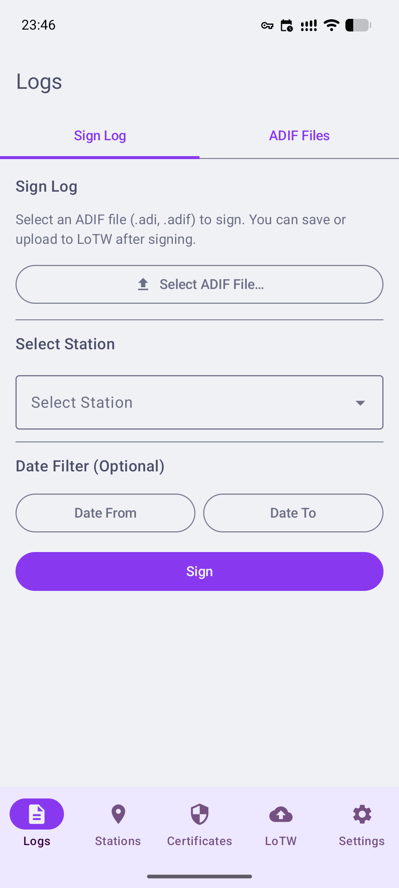
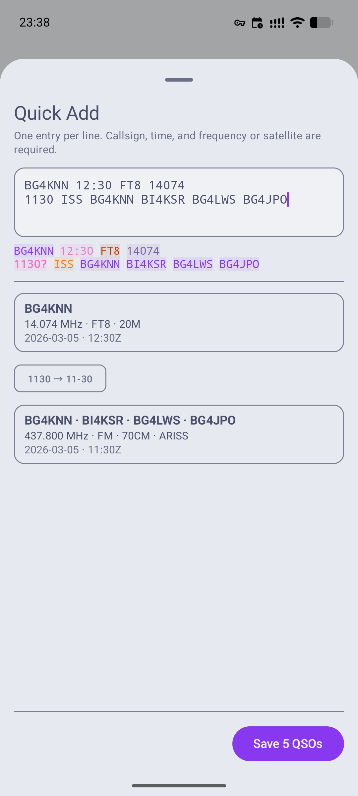
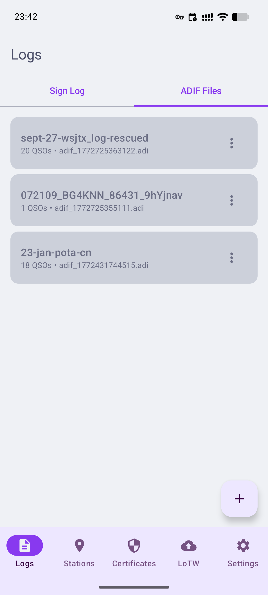
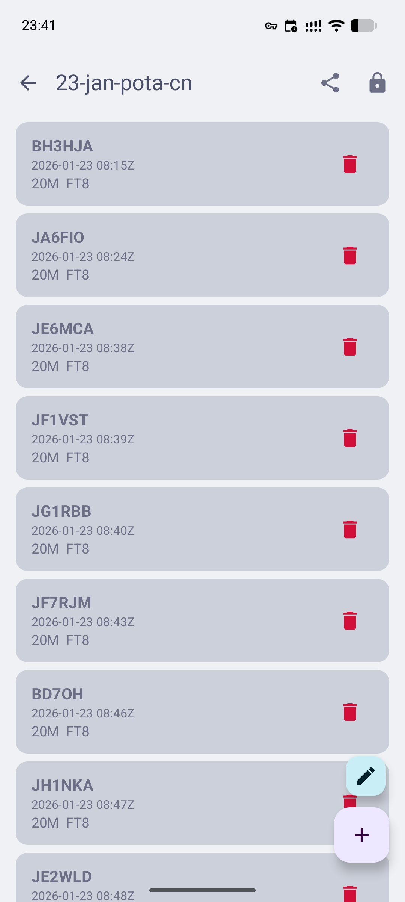

<div align="center">

# TaffyQSL

<p align="center">
  
</p>
<p><br/></p>
<p align="center">
  <a href="https://github.com/sophiel-meow/TaffyQSL/releases/latest">
    
  </a>
</p>

[](LICENSE)
[](https://kotlinlang.org)
[](https://developer.android.com)

[English](README.md) | [简体中文](README.zh-CN.md) | 日本語 

[使用説明書](docs/USER_MANUAL.md)

</div>

---

TaffyQSL は、Android 向けの 100% 自由・オープンソース・プライバシー重視のアマチュア無線交信ログソフトウェアです。  
ADIF ファイル管理、QSO 署名、LoTW 連携をサポートし、Android Keystore による**ハードウェアバックド鍵保護**を実現しています。  
プライバシーとセキュリティを重視するアマチュア無線家のために設計されており、証明書とログはデバイス上に安全に保管されます。

## 機能

- ADIF ファイルの作成・編集・エクスポート
- LoTW 互換の QSO 署名
- ハードウェアバックドによる秘密鍵保護（デバイスの対応状況による）
- 自然言語 QSO パーサーによる迅速・簡単なログ記録
- 衛星通信および DXCC エンティティのサポート
- 日付・時刻表示形式のカスタマイズ

## スクリーンショット

<p align="center">
  
  
  
  
</p>

## プライバシーとセキュリティ

- **鍵はデバイス上でローカルに生成・保管**（Android Keystore 使用）
- **秘密鍵はローカルの Android Keystore に保管されます**
- **鍵が外部サーバーに送信されることは一切ありません**
- **オプションのバックアップは常にユーザーが管理します**
- **テレメトリーやトラッキングは一切なし**
- **100% 無償・オープンソース**
- LoTW との連携中もプライバシーを徹底保護

## インストール

- **最低 Android バージョン：** Android 11（API 30）
- [Releases](https://github.com/sophiel-meow/TaffyQSL/releases) ページから最新 APK をダウンロード
- F-Droid 版は近日公開予定

## ソースからのビルド

TaffyQSL は Kotlin で記述され、Gradle Kotlin DSL を使用しています。
```bash
git clone git@github.com:sophiel-meow/TaffyQSL.git
cd TaffyQSL
./gradlew assembleDebug
```

**ビルド要件**

- JDK 21
- Android Studio（最新安定版）
- API レベル 36 以上の Android SDK

## 免責事項

- 本ソフトウェアは「現状のまま」提供され、いかなる保証も行いません。
- 使用は自己責任でお願いします。
- LoTW は American Radio Relay League, Inc. の登録商標です。
- TaffyQSL は独立したプロジェクトであり、ARRL との関連・推薦はありません。
- ハードウェアバックド暗号化はデバイスの機能に依存します。

## コントリビューション

コントリビューションを歓迎します！

- 機能リクエストやバグ報告は Issue にてお知らせください
- バグ修正や改善の Pull Request を受け付けています
- ディスカッション・Issue・コントリビューションは**英語（推奨）、中国語、または日本語**でどうぞ

## TODO

- [ ] F-Droid リリースの最適化
- [ ] PIN・生体認証サポート
- [ ] 追加衛星サポート
- [ ] バックアップ機能
- [ ] QRZ.com オンラインクエリ / 同期
- [ ] 統計機能

## ライセンス

Copyright (C) 2026 Sophiel (BG4KNN)

TaffyQSL は **GNU General Public License v3.0** のもとで公開されたフリーソフトウェアです。  
GPL の条件のもと、自由に使用・研究・改変・再配布することができます。

🄯 Copyleft 2026 Sophiel (BG4KNN)

本プロジェクトは独立したプロジェクトであり、ARRL および Logbook of the World とは一切関係なく、推薦も受けていません。  
すべての商標はそれぞれの所有者に帰属します。

## Credits

Designed by Sophiel & Alice

Inspiration:
- [TrustedQSL](https://sourceforge.net/projects/trustedqsl/)
- [X-QSL](https://gitee.com/yuzhenwu/x-qsl-amateur-radio-adif-tool)

